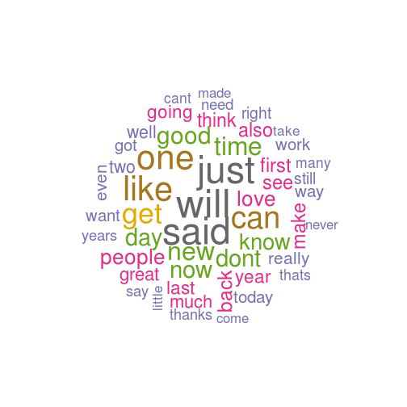
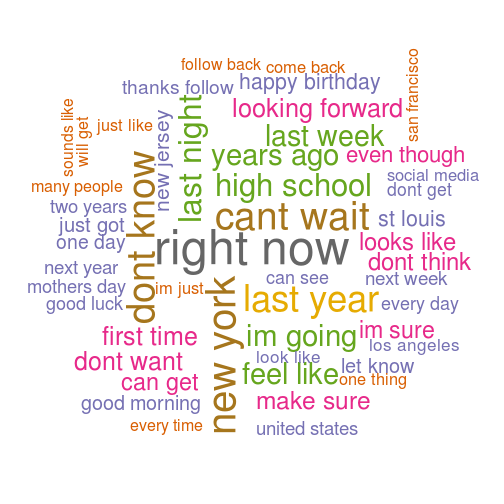
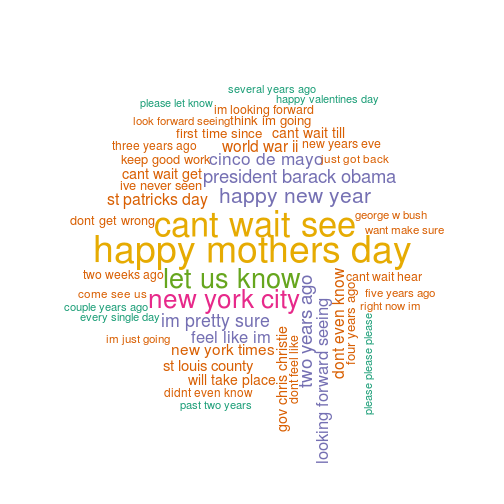

SwiftKey Data Analysis
========================================================

# Introduction
We analyze here the Swift key text corpus for purposes of data exploration. We will eventually use this information to build a predictive model to predict the next word by looking at previous 1, 2 or 3 words.

# Setup environment
We get the data from [coursera link](https://d396qusza40orc.cloudfront.net/dsscapstone/dataset/Coursera-SwiftKey.zip). The english dataset consists of 3 files - 
* en_US.blogs.txt
* en_US.news.txt
* en_US.twitter.txt

We use tm, wordcloud, RWeka packages for analysis and exploration.


```r
# Allocate good memory, but only 1 core (for issues with RWeka package)
options(java.parameters = "-Xmx8g", mc.cores = 1)

# Load packages
library(doMC)
```

```
Load packages for text data analysis and exploration Loading required package: foreach
Load packages for text data analysis and exploration Loading required package: iterators
Load packages for text data analysis and exploration Loading required package: parallel
```

```r
library(tm)
```

```
Load packages for text data analysis and exploration Loading required package: NLP
```

```r
library(SnowballC)
library(wordcloud)
```

```
Load packages for text data analysis and exploration Loading required package: RColorBrewer
```

```r

# For parallel issues with RWeka package
registerDoMC(1)
```


The location of original and sampled data is here -

```r
baseDir <- "/home/kmalik/Git/DataScienceCapstone"

# SwiftKey data is unzippped here -
dataDir <- paste(baseDir, "Dataset/Coursera-SwiftKey/final/en_US", sep = "/")
blogsName <- "en_US.blogs.txt"
newsName <- "en_US.news.txt"
twitterName <- "en_US.twitter.txt"

# We will dump sample data here -
sample10Dir <- paste(baseDir, "Sample10", sep = "/")
sample5Dir <- paste(baseDir, "Sample5", sep = "/")

# Set seed for reproducible sampling
set.seed(13309)
```


# Load and sample data

## Original data
We analyze the original data using system commands as follows -


```r
# File size
blogsSize <- as.numeric(strsplit(system(paste("ls -l", paste(dataDir, blogsName, 
    sep = "/")), intern = TRUE), " ")[[1]][5])/(1e+06)
newsSize <- as.numeric(strsplit(system(paste("ls -l", paste(dataDir, newsName, 
    sep = "/")), intern = TRUE), " ")[[1]][5])/(1e+06)
twitterSize <- as.numeric(strsplit(system(paste("ls -l", paste(dataDir, twitterName, 
    sep = "/")), intern = TRUE), " ")[[1]][5])/(1e+06)

# Line counts
blogsLines <- strsplit(system(paste("wc -l", paste(dataDir, blogsName, sep = "/")), 
    intern = TRUE), " ")[[1]][1]
newsLines <- strsplit(system(paste("wc -l", paste(dataDir, newsName, sep = "/")), 
    intern = TRUE), " ")[[1]][1]
twitterLines <- strsplit(system(paste("wc -l", paste(dataDir, twitterName, sep = "/")), 
    intern = TRUE), " ")[[1]][1]

# Word counts
blogsWords <- strsplit(system(paste("wc -w", paste(dataDir, blogsName, sep = "/")), 
    intern = TRUE), " ")[[1]][1]
newsWords <- strsplit(system(paste("wc -w", paste(dataDir, newsName, sep = "/")), 
    intern = TRUE), " ")[[1]][1]
twitterWords <- strsplit(system(paste("wc -w", paste(dataDir, twitterName, sep = "/")), 
    intern = TRUE), " ")[[1]][1]
totalWords <- as.numeric(blogsWords) + as.numeric(newsWords) + as.numeric(twitterWords)
```

Blogs file is of 210.16MBs and contains 899288 lines and 37334114 words. News file is of 205.8119MBs and contains 1010242 lines and 34365936 words. Twitter file is of 167.1053MBs and contains 2360148 lines and 30359804 words.

## Sample data
We sample data so that it can be analyzed with reasonable resources (like memory, processing time etc.). We use rbinom function to create the sample.


```r
createSample <- function(inDir, outDir, filename, ratio) {
    con <- file(paste(inDir, filename, sep = "/"), "rb")
    all <- readLines(con)
    sampling <- rbinom(all, 1, ratio)
    sample <- all[sampling == 1]
    writeLines(sample, paste(outDir, filename, sep = "/"))
    close(con)
    sample
}

# Create sample of 10% data
createSample(dataDir, sample10Dir, blogsName, 0.1)
createSample(dataDir, sample10Dir, newsName, 0.1)
createSample(dataDir, sample10Dir, twitterName, 0.1)

# Create sample of 5% data
createSample(dataDir, sample5Dir, blogsName, 0.05)
createSample(dataDir, sample5Dir, newsName, 0.05)
createSample(dataDir, sample5Dir, twitterName, 0.05)
```


# Data analysis

## Cleanup
We load the text corpus and clean it up as follows -
* Remove numbers
* Remove punctuation
* Remove extra whitespace
* Convert to lowercase
* Remove stop-words
* Stemming ('play' and 'playing' are counted as same)


```r
loadCorpus <- function(dir) {
    a <- VCorpus(DirSource(dir), readerControl = list(language = "eng"))
    a <- tm_map(a, removeNumbers)
    a <- tm_map(a, removePunctuation)
    a <- tm_map(a, stripWhitespace)
    a <- tm_map(a, tolower)
    a <- tm_map(a, removeWords, stopwords("english"))
    a <- tm_map(a, stemDocument, language = "english")
    a <- tm_map(a, PlainTextDocument)
    a
}

# 10% sample corpus
corpus10 <- loadCorpus(sample10Dir)

# 5% sample corpus
corpus5 <- loadCorpus(sample5Dir)
```


## Word frequency distribution
We compute the frequency distribution of words by creating a term-document matrix.


```r
createDf <- function(tdm) {
    termSums <- rowSums(as.matrix(tdm))
    sortedSums <- sort(termSums, decreasing = TRUE)
    data.frame(word = names(sortedSums), freq = sortedSums)
}

# Data frame of word frequency from 5% sample corpus
df5 <- createDf(TermDocumentMatrix(corpus5))
# Number of unique words in sample
n5 <- nrow(df5)
# Number of total words in sample
sum5 <- sum(df5$freq)
# Percentage of total words in original dataset
pc5 <- sum5 * 100/totalWords

# Data frame of word frequency from 10% sample corpus
df10 <- createDf(TermDocumentMatrix(corpus10))
# Number of unique words in sample
n10 <- nrow(df10)
# Number of total words in sample
sum10 <- sum(df10$freq)
# Percentage of total words in original dataset
pc10 <- sum10 * 100/totalWords
```


So in our 10% sampled dataset, there are 221961 unique words, and total of 5.4448 &times; 10<sup>6</sup> words (5.3349% of original dataset).

While in our 5% sampled dataset, there are 147769 unique words, and total of 2.7375 &times; 10<sup>6</sup> words (2.6823% of original dataset). We will use 5% sampled dataset now onwards for our purposes.

Frequency distribution histogram of most commonly occuring 100 words

```r
hist(df5[1:100, ]$freq, main = "Top 100 words frequency distribution", xlab = "Frequency", 
    ylab = "Words")
```

 

As observed from the figure, in top 100, only 5 words have frequency more than 10000, and 50 words have frequency less than 2000. 

The frequency drops even more sharply as we consider top 1000 words. 600 out of 1000 words have frequency less than 1000.

```r
hist(df5[1:1000, ]$freq, main = "Top 1000 words frequency distribution", xlab = "Frequency", 
    ylab = "Words")
```

 


## Words needed for representing data

```r
computePct <- function(df) {
    df$cumFreq <- cumsum(df$freq)
    n <- nrow(df)
    sum <- sum(df$freq)
    sum50 <- 0.5 * sum
    sum90 <- 0.9 * sum
    n50 <- nrow(df[df$cumFreq < sum50, ]) + 1
    n90 <- nrow(df[df$cumFreq < sum90, ]) + 1
    p50 <- n50 * 100/n
    p90 <- n90 * 100/n
    list(n = n, sum = sum, n50 = n50, n90 = n90, p50 = p50, p90 = p90)
}
pct <- computePct(df5)
```

Also, we notice that 1034 unique words are sufficient to represent 50% of total words in sample data. These are only 0.6997% of total unique words in sample data.
Similarly, 1.806 &times; 10<sup>4</sup> unique words are sufficient to represent 90% of total words in sample data. These are only 12.2218% of total unique words in sample data.

# NGram distribution
We analyze the unigram, bigram and trigram distribution in sample data.


```r
createTdm <- function(corpus, numTokens) {
    token_delim <- " \\t\\r\\n.!?,;\"()"
    tok <- function(x) RWeka::NGramTokenizer(x, RWeka::Weka_control(min = numTokens, 
        max = numTokens, delimiters = token_delim))
    TermDocumentMatrix(corpus, control = list(tokenize = tok))
}

# Bigram distribution in sample
df5Bigrams <- createDf(createTdm(corpus5, 2))
# Number of unique bigrams in sample
nBigrams <- nrow(df5Bigrams)

# Trigram distribution in sample
df5Trigrams <- createDf(createTdm(corpus5, 3))
# Number of unique trigrams in sample
nTrigrams <- nrow(df5Trigrams)
```

There are 1840511 unique bigrams in the sample data. There are 2340158 unique trigrams in the sample data.

## Word cloud visualization
The word cloud visualization of unigrams, bigrams, trigrams is shown below. The size of words represents the frequency of corresponding n-gram. Bigger size implies higher frequency.


```r
drawWordCloud <- function(df) {
    wordcloud(words = df$word, freq = df$freq, scale = c(4, 0.5), min.freq = 10, 
        max.words = 50, rot.per = 0.15, random.order = FALSE, ordered.colors = FALSE, 
        colors = brewer.pal(8, "Dark2"))
}
```


**Unigram word cloud**
50 most commonly occuring words.

```r
# Word cloud for unigrams
drawWordCloud(df5)
```

 


**Bigram word cloud**
50 most commonly occuring bi-grams. For example : 'right now', 'cant wait', 'last year' etc.

```r
# Word cloud for bigrams
drawWordCloud(df5Bigrams)
```

 


**Trigram word cloud**
50 most commonly occuring tri-grams. For example : 'happy mothers day', 'new york city' etc.

```r
# Word cloud for trigrams
drawWordCloud(df5Trigrams)
```

```
## Warning: vested interests vested could not be fit on page. It will not be plotted.
## Warning: interests vested interests could not be fit on page. It will not be plotted.
```

 


# Text Prediction Application
As a next step, we will use this analysis to build a model for predicting next word, from the previous words, and demonstrate it via a Shiny app. The basic approach towards the app will be as follows -

## Prediction model
* From the 5% sampled dataset, keep unigrams, bigrams, trigrams representing 90% of sample data, sorted by frequency.
* If user inputs a single word
  + See if it matches first word in any of the bigrams, if yes, show top 3 suggestions for second word of bigram.
  + Else, see if it matches first word in any of the trigrams, if yes, show top 3 suggestions for second word of trigram
  + Else, see if it matches second word in any of the trigrams, if yes, show top 3 suggestions for third word of trigram
  + Else, show top 3 suggestions of unigrams as a general rule
* If user inputs two words
  + See if they match first two words in any of the trigrams, if yes, show top 3 suggestions for the third word.
  + Else, follow the procedure for matching second word as a single word, mentioned above.

## Model validation
* Generate top bigrams and trigrams for another 5% randomly sampled dataset, and see whether the prediction model is able to suggest the correct next word, as the best match, or in top 3 matches.
* If the model is able to predict more than 70% of the top NGrams, then use the errors to enrich the prediction model above.
* Else, if model predicts less than 70% of top NGrams, then take a fresh random sample data to create a predictive model.

## Feedback
* In the Shiny app, also keep a provision for user to input a new suggestion, in case it does not match any of the suggestions from our model. 
* Use this input to enrich the prediction model for future suggestions.
